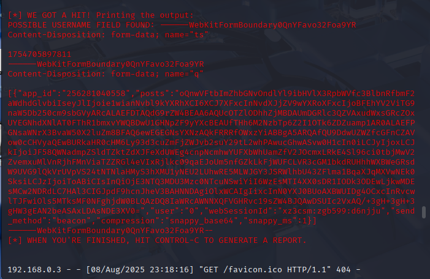
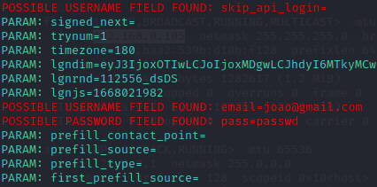

# Desafio Cybersecurity
Criando um phishing e testando a captura de senha em um site falso, utilizando Kali Linux e setoolkit

## Comandos no Kali Linux
- ```setoolkit```
- Opção 1: Social-Engineering Attacks
- Opção 2: Web Site Attack Vectors
- Opção 3: Credential Havester Attack Method
- Opção 2: Site Cloner - URL utilizada para clonar: [Facebook](http://www.facebook.com)
- Para saber o IP da máquina: ```ifconfig```


## Resultados




